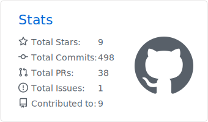
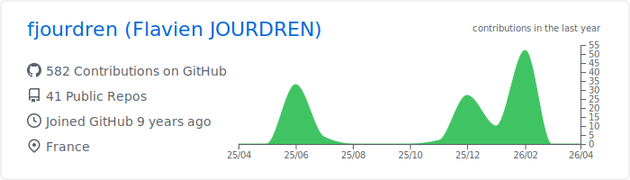

<!-- header -->
<picture></picture>

<h1 align="center">Flavien Jourdren | Software Engineer<picture></picture></h1>

  <picture>
    
  </picture>

 

<!-- Connect with me -->

&nbsp;
&nbsp;
&nbsp;

## 🎯 Professional Summary

**Experienced Software Engineer** specializing in **full-stack development**, **cloud architecture**, and **enterprise solutions**. Based in Brest, France, I transform complex business requirements into scalable, high-performance applications with a focus on **clean code**, **robust architecture**, and **user experience**.

### Key Strengths
- **Full-Stack Expertise**: End-to-end development from frontend to backend infrastructure
- **Cloud-Native Solutions**: Extensive experience with Docker and Kubernetes
- **Performance Optimization**: Proven track record of building high-traffic, scalable systems
- **Legacy Modernization**: Successfully refactoring and modernizing existing codebases
- **DevOps & CI/CD**: Streamlining development workflows and deployment processes

## 🛠️ Technical Expertise

### **Frontend Development**
- **React.js & Next.js** - Modern, responsive web applications
- **TypeScript & JavaScript** - Type-safe, maintainable code
- **HTML5 & CSS** - Semantic markup and modern styling

### **Backend Development**
- **Node.js** - High-performance server-side applications
- **Java & Spring** - Enterprise-grade backend services and batches
- **Python & Go** - Versatile backend solutions
- **REST APIs** - Clean, well-documented API design

### **Database & Storage**
- **Oracle & PostgreSQL** - Relational database management
- **MongoDB** - NoSQL solutions for flexible data models
- **Redis** - High-performance caching and session management

### **Cloud & DevOps**
- **Docker & Kubernetes** - Containerization and orchestration
- **Helm** - Kubernetes package management
- **GitLab CI/CD & Jenkins** - Automated deployment pipelines

 

Learn more about my experience on <a href="https://www.linkedin.com/in/flavien-jourdren/">LinkedIn</a>.

## 🏗️ Professional Experience

### **Core Competencies**
- **System Architecture**: Designing scalable, maintainable software systems
- **Data Structures & Algorithms**: Optimizing performance and efficiency
- **Domain Modeling**: Translating business logic into clean, testable code
- **Code Quality**: Writing maintainable, well-documented, and tested code
- **Security Best Practices**: Implementing enterprise-grade security measures

### **Project Highlights**
- **Full-Stack Applications**: Complete web applications with modern tech stacks
- **Microservices Architecture**: Distributed systems with clear service boundaries
- **Legacy System Integration**: Modernizing existing systems while maintaining functionality
- **Cloud Migration**: Moving applications to cloud infrastructure
- **CI/CD & Automation**: Streamlining development workflows and deployment processes

## 🚀 Featured Projects

<table align="center">
  <thead align="center">
      <tr border: none;>
      <td><b>🚀 Project</b></td>
      <td><b>⭐ Stars</b></td>
      <td><b>📚 Forks</b></td>
      <td><b>🛎 Issues</b></td>
      <td><b>📬 Pull Requests</b></td>
      </tr>
  </thead>
  <tbody>
      <tr>
      <td><a href="https://github.com/fjourdren/Theatrum"><b>Theatrum</b></a></td>
      <td><picture></picture></td>
      <td><picture></picture></td>
      <td><picture></picture></td>
      <td><picture></picture></td>
      </tr>
  </tbody>
</table>

## 📝 Technical Writing & Knowledge Sharing

I (try) maintaining a technical blog focused on **software engineering best practices**, **system design patterns**, and **emerging technologies**. My articles provide practical insights into real-world challenges and architectural decisions.

### **Recent Articles**
- [Installation de devstack](https://fjourdren.com/installation-de-devstack)
- [Réaliser une API REST](https://fjourdren.com/Realiser-API-REST)
- [Déploiement continu et automatique avec Docker et Jenkins](https://fjourdren.com/deploiement-continu-et-automatique-avec-docker-et-Jenkins)
- [Rappel sur la répartition de charge](https://fjourdren.com/rappel-sur-la-repartition-de-charge)
- [Installation de Jenkins](https://fjourdren.com/installation-de-jenkins)

📖 **Read more at:** [fjourdren.com](https://fjourdren.com)

<!-- Statistics -->
<h2>📊 GitHub Analytics & Contributions</h2>

  <picture>
    
  </picture>

 

  <picture>
    
  </picture>

 

  <picture>
    
  </picture>

## 📫 Let's Connect

I'm always interested in connecting with **fellow developers**, **tech leaders**, and **innovative companies**. Whether you want to discuss potential opportunities, collaborate on projects, or exchange ideas about emerging technologies, I'd love to hear from you!

**Preferred Contact Methods:**
- **LinkedIn**: [flavien-jourdren](https://www.linkedin.com/in/flavien-jourdren/)
- **Website**: [fjourdren.com](https://fjourdren.com)

---

<!-- footer -->
<h3 align="center">Interested in my work? Star ⭐ the repositories that catch your attention!</h3>

<picture></picture>

<picture>
</picture>
