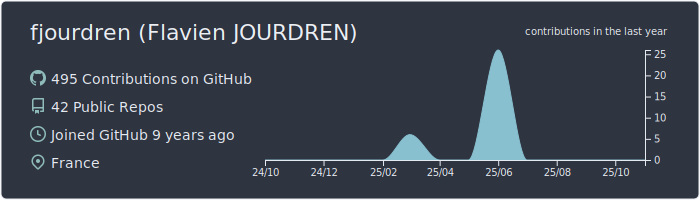
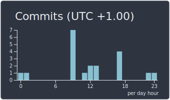
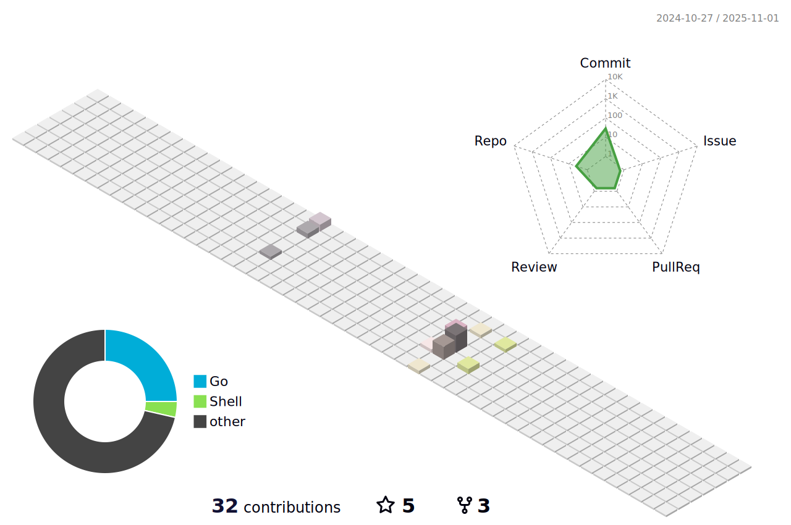

<!-- header -->

<picture></picture>

<h1 align="center">Hi, I'm Flavien <picture></picture> !</h1>

<!-- Connect with me -->

&nbsp;
&nbsp;
&nbsp;
&nbsp;
<!--&nbsp;-->
&nbsp;

👋 Hello! I’m Flavien JOURDREN, a passionate self-taught software engineer  based in France. I am versatile and able to easily adapt to different roles (Full Stack Web Developer, App Developer, ML Engineer 🤖, System Architect or Cloud Engineer) depending on the needs of the project. Furthermore, I love exploring new technologies and leveraging them to build cool stuffs 🛠️.

I love exploring new technologies and use them to solve real-world problems ✨, helping people by providing them unique software and tools, automating my workflows, managing my entire life on Notion and reading a lot of newsletters on system design choices of large technology companies.

My passion for software 💻 lies dreaming up ideas and making them come true with elegant interfaces. I take great care in the architecture, user experience, performance, security, and code quality. Following best practices early on is the way to go, and I'm a huge supporter of it 🧃. I strongly believe that technology holds the power to advance how we organize and lead the economy, and democratizing the internet would be a foundational step towards that.

<!-- Technologies I use -->
<h2>🛠 Technologies I use</h2>

Some technologies I enjoy working with include Next.js, React.js, Javascript/Typecript, Redis, RabbitMq, Docker and Python (you can check out my <a href="https://www.linkedin.com/in/flavien-jourdren/">LinkedIn profile</a> to have an "exhaustive" list). I’m slightly obsessed by Web3 📎, Machine learning 🧠, cloud systems ☁️ and Data Structures/Algorithms 🤓. Occasionally, I also experiment in Mobile Development and Low-level programming languages.

<!-- Meet -->
<h2>📫 Like to meet me?</h2>

I enjoy connecting with people across a wide range of backgrounds so if you want to say hi or bounce ideas off of me, I'll be happy that you connect with me on <a href="https://www.linkedin.com/in/flavien-jourdren/">Linkedin</a>! 😊
Additionally, you can also pick a slot from my agenda if you'd like to meet me and chat about anything you are passionate about.

<h2>⚡️ A Few Quick Facts</h2>

- 🌱 Currently, I am focusing on learning more about Systems Design and Cloud/Serverless Architecture.
- ✍️ In my free time, I enjoy reading 📚, participating in sports 🤸‍♂️, and working on my side projects 💼.
- 📝 I <strike>regularly</strike> publish articles on my <a href="https://fjourdren.com">website</a>.
- 💬 Ask me about anything here! I am happy to help. ✌️
- 📝 Checkout my <a href="https://www.linkedin.com/in/flavien-jourdren/">resume</a>.
- 📫 Some freelance work? Feel free to <a href="https://www.linkedin.com/in/flavien-jourdren/">ping me</a>
- 👾 Banging your head against a wall for one hour burns 150 calories.
- ☀️ Coder at day & Coder at night

<!-- projects -->
<h2>🚀 Projects</h2>

I am working on many various side projects 🏗️ with a wide range of technical stacks. These projects involve building and using Machine Learning models, deploying custom cloud architecture, driving scalable services to production and designing systems with many technologies 🗺️.

I am also an open-source advocate :octocat:. I learned a lot from the open-source community, and I love how collaboration and knowledge sharing happened through open-source. Always open to collaborating on projects and innovative/disruptive ideas. However, due to my demanding job and side projects, I'm not able to contribute as much as I would like to the community 😔.

<h3>💼 Some projects</h3>
<table align="center">
<thead align="center">
    <tr border: none;>
    <td><b>🎁 Projects</b></td>
    <td><b>⭐ Stars</b></td>
    <td><b>📚 Forks</b></td>
    <td><b>🛎 Issues</b></td>
    <td><b>📬 Pull requests</b></td>
    </tr>
</thead>
<tbody>
    <tr>
    <td><a href="https://github.com/fjourdren/CyberDoc"><b>CyberDoc</b></a></td>
    <td><picture></picture></td>
    <td><picture></picture></td>
    <td><picture></picture></td>
    <td><picture></picture></td>
    </tr>
    <tr>
    <td><a href="https://github.com/fjourdren/Blockchain_Go"><b>Blockchain Go</b></a></td>
    <td><picture></picture></td>
    <td><picture></picture></td>
    <td><picture></picture></td>
    <td><picture></picture></td>
    </tr>
    <tr>
    <td><a href="https://github.com/fjourdren/spaceinvaders"><b>Space Invaders</b></a></td>
    <td><picture></picture></td>
    <td><picture></picture></td>
    <td><picture></picture></td>
    <td><picture></picture></td>
    </tr>
</tbody>
</table>

<!-- Last blog posts -->
<h2>✏️ Blog</h2>

I enjoy exploring emerging technologies 💡 and I try to <strike>regularly</strike> publish articles on my website about my recent learning and technical challenges, you can check it out here : <a href="https://fjourdren.com">fjourdren.com</a>.

<h3>⌛ Last articles</h3>
<ul>
<!-- BLOG-POST-LIST:START --><li><a href="https://fjourdren.com/installation-de-devstack">Installation de devstack</a></li><li><a href="https://fjourdren.com/Realiser-API-REST">Réaliser une API REST</a></li><li><a href="https://fjourdren.com/deploiement-continu-et-automatique-avec-docker-et-Jenkins">Déploiement continu et automatique avec Docker et Jenkins</a></li><li><a href="https://fjourdren.com/rappel-sur-la-repartition-de-charge">Rappel sur la répartition de charge</a></li><li><a href="https://fjourdren.com/installation-de-jenkins">Installation de Jenkins</a></li><!-- BLOG-POST-LIST:END -->
</ul>

<!-- My Contributions -->
<h2>❤️ Contribute</h2>

Please consider starring 🌟 my repositories if you find any of them interesting. Your support could brighten someone's day 😄. Additionally, feel free to create a pull request or contribute in any way you wish.

<h3>👦🏻 Boy Scout rules</h3>

As previously mentioned, I love open source :octocat:. I am not a heavy maintainer of any large libraries, but I really like the boy scout rule. I contribute to things as I come across issues that I think other people might struggle with. This may be things that are overlooked by someone who is deep into the library. I 💕 a well-written readme with good example.

<!-- Statistics -->
<h2>📊 Statistics</h2>
<picture>

</picture>

<picture></picture><picture></picture><picture></picture>

 

<picture style="margin-bottom: 40px">

</picture>

 

<picture>

</picture>

<!-- Lastest activities -->
<h2>⚡ Recent Github Activity</h2>
<ul>
<!--START_SECTION:activity-->
1. 🗣 Commented on [#46](https://github.com/jamesgeorge007/github-activity-readme/issues/46) in [jamesgeorge007/github-activity-readme](https://github.com/jamesgeorge007/github-activity-readme)
<!--END_SECTION:activity-->
</ul>

<!-- parrots -->
<h2>🦜 Here are some <a href="https://cultofthepartyparrot.com">parrots</a></h2>

    
    
    
    
    
    
    
    
    
    
    
    
    
    
    
    
    
    
    
    
    
    
    

 

<!-- footer -->
<h3 align="center">Show some &nbsp;❤️&nbsp; by starring some of the repositories!</h3>

<picture></picture>

<picture>
</picture>
