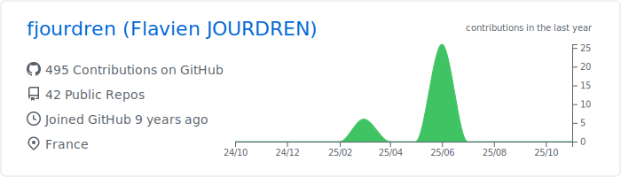

<!-- header -->
<picture></picture>

<h1 align="center">Flavien Jourdren | Software Engineer<picture></picture></h1>

<!-- Connect with me -->

&nbsp;
&nbsp;
&nbsp;

  
  

## 🎯 Professional Summary

Software Engineer, Lead Tech, and Solution Architect, operating **end-to-end** from **system design to production**, shaping **architectural decisions**, **leading technical teams**, and ensuring **long-term scalability, performance, and maintainability** of complex systems. I focus on **durable system design** that **scales sustainably** and **enables automated delivery**, while maintaining a **pragmatic balance between business constraints and continuous system evolution**.

<table align="center">
  <thead align="center">
      <tr border: none;>
      <td><b>🚀 Project</b></td>
      <td><b>⭐ Stars</b></td>
      <td><b>📚 Forks</b></td>
      <td><b>🛎 Issues</b></td>
      <td><b>📬 Pull Requests</b></td>
      </tr>
  </thead>
  <tbody>
      <tr>
      <td><a href="https://github.com/fjourdren/Theatrum"><b>Theatrum</b></a></td>
      <td><picture></picture></td>
      <td><picture></picture></td>
      <td><picture></picture></td>
      <td><picture></picture></td>
      </tr>
  </tbody>
</table>

### 🧩 Key Competencies & Strengths

- **Architecture & Distributed Systems**: microservices,  API contracts, event-driven design
- **Core Technologies**: `Java`, `TypeScript`, `JavaScript`, `Next.js`, `Kubernetes`
- **Modern Infrastructure Practices**: containers, orchestration, GitOps mindset, CI/CD pipelines
- **Business Analyst Mindset**: bridging product needs with architecture decisions, modeling complex domains
- **Legacy System Exploration**: reverse engineering complex codebases, designing modernization paths with minimal disruption
- **Engineering Quality**: testing, documentation, maintainability, technical clarity
- **Technical Leadership**: system design decisions, team leading

## 📝 Knowledge Sharing

I (try) maintaining a technical blog focused on **software engineering best practices**, **system design patterns**, and **emerging technologies**. My articles provide practical insights into real-world challenges and architectural decisions.

### **Recent Articles**
- [Installation de devstack](https://fjourdren.com/installation-de-devstack)
- [Réaliser une API REST](https://fjourdren.com/Realiser-API-REST)
- [Déploiement continu et automatique avec Docker et Jenkins](https://fjourdren.com/deploiement-continu-et-automatique-avec-docker-et-Jenkins)
- [Rappel sur la répartition de charge](https://fjourdren.com/rappel-sur-la-repartition-de-charge)
- [Installation de Jenkins](https://fjourdren.com/installation-de-jenkins)

📖 **Read more :** [fjourdren.com](https://fjourdren.com)

## 📫 Let's Connect

**Preferred Contact Methods:**
- **LinkedIn**: [flavien-jourdren](https://www.linkedin.com/in/flavien-jourdren/)
- **Website**: [fjourdren.com](https://fjourdren.com)

---

<!-- footer -->
<h3 align="center">Interested in my work? Star ⭐ the repositories that catch your attention!</h3>

  <picture></picture>

<picture>
  
</picture>
